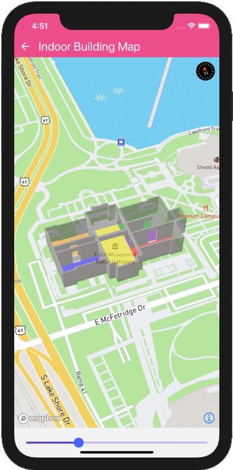
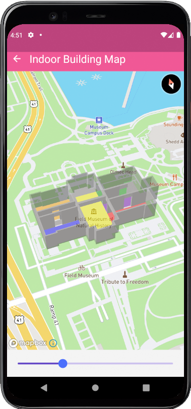

# VnMapPlugin - Maps SDK for React Native

[](https://badge.fury.io/js/%40vnmapplugin%2Fmaps)
[](https://github.com/tommyannguyen/vnmapplugin/actions/workflows/npm-publish.yml)

_A React Native library for building maps with the VnMapPlugin native SDK for iOS and Android._

---

<table>
<tr>
<td align="center"><b>iOS</b></td>
<td align="center"><b>Android</b></td>
</tr>
<tr>
<td></td>
<td></td>
</tr>
</table>

---

## Prerequisites

1. Obtain your VnMapPlugin access token from your [VnMapPlugin account](https://github.com/tommyannguyen/vnmapplugin).

## Dependencies

- [Node.js](https://nodejs.org) (v22+)
- [npm](https://www.npmjs.com/) or [yarn](https://yarnpkg.com/)
- [React Native](https://reactnative.dev/) (0.79+)

## Installation

```sh
npm install @vnmapplugin/maps
# or
yarn add @vnmapplugin/maps
```

### Platform Setup

- [iOS installation guide](ios/install.md)
- [Android installation guide](android/install.md)

For detailed instructions, see the [Getting Started](/docs/GettingStarted.md) guide.

## Quick Start

```js
import React from 'react';
import { StyleSheet, View } from 'react-native';
import VnMapPlugin from '@vnmapplugin/maps';

VnMapPlugin.setAccessToken('<YOUR_ACCESSTOKEN>');

const App = () => {
  return (
    <View style={styles.page}>
      <View style={styles.container}>
        <VnMapPlugin.MapView style={styles.map} />
      </View>
    </View>
  );
};

export default App;

const styles = StyleSheet.create({
  page: {
    flex: 1,
    justifyContent: 'center',
    alignItems: 'center',
  },
  container: {
    height: 300,
    width: 300,
  },
  map: {
    flex: 1,
  },
});
```

## Run the Example App

```sh
# iOS
cd example && yarn ios

# Android
cd example && yarn android
```

---

## Documentation

### Components

- [MapView](/docs/MapView.md)
- [Camera](/docs/Camera.md)
- [UserLocation](/docs/UserLocation.md)
- [LocationPuck](/docs/LocationPuck.md)
- [PointAnnotation](/docs/PointAnnotation.md)
- [MarkerView](/docs/MarkerView.md)
- [Callout](/docs/Callout.md)
- [Images](/docs/Images.md)
- [Image](/docs/Image.md)
- [Models](/docs/Models.md)
- [StyleImport](/docs/StyleImport.md)
- [Light](/docs/Light.md)
- [StyleSheet](/docs/StyleSheet.md)

### Sources

- [VectorSource](/docs/VectorSource.md)
- [ShapeSource](/docs/ShapeSource.md)
- [RasterSource](/docs/RasterSource.md)
- [RasterDemSource](/docs/RasterDemSource.md)

### Layers

- [BackgroundLayer](/docs/BackgroundLayer.md)
- [CircleLayer](/docs/CircleLayer.md)
- [FillLayer](/docs/FillLayer.md)
- [FillExtrusionLayer](/docs/FillExtrusionLayer.md)
- [LineLayer](/docs/LineLayer.md)
- [RasterLayer](/docs/RasterLayer.md)
- [SymbolLayer](/docs/SymbolLayer.md)
- [HeatmapLayer](/docs/HeatmapLayer.md)
- [SkyLayer](/docs/SkyLayer.md)
- [ModelLayer](/docs/ModelLayer.md)

### Terrain

- [Terrain](/docs/Terrain.md)
- [Atmosphere](/docs/Atmosphere.md)

### Offline

- [OfflineManager](/docs/OfflineManager.md)
- [SnapshotManager](/docs/snapshotManager.md)

### Misc

- [VnMapPlugin](/docs/VnMapPlugin.md)
- [CustomHttpHeaders](/docs/CustomHttpHeaders.md)
- [Logger](/docs/Logger.md)

---

## Expo Support

This package is not available in [Expo Go](https://expo.io/client). Learn how to use it with [custom dev clients](/plugin/install.md).

## Testing with Jest

```json
"jest": {
  "preset": "react-native",
  "setupFilesAfterFramework": ["@vnmapplugin/maps/setup-jest"],
  "transformIgnorePatterns": [
    "node_modules/(?!(...|@vnmapplugin))"
  ]
}
```

## Contributing

Have a question or need help? Use [GitHub Discussions](https://github.com/tommyannguyen/vnmapplugin/discussions).

## License

[MIT](./LICENSE.md)
